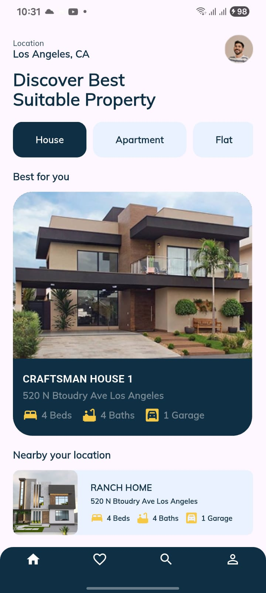
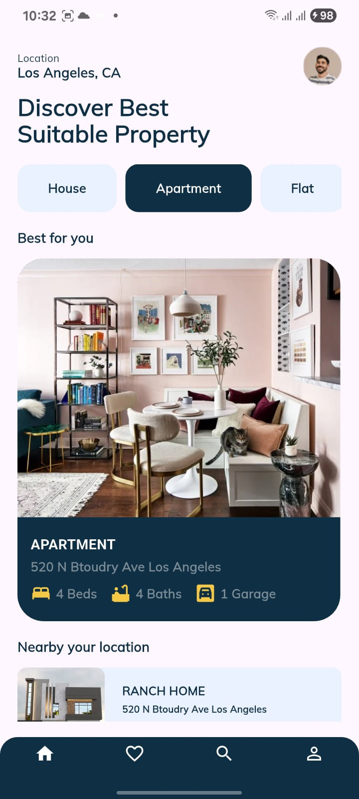
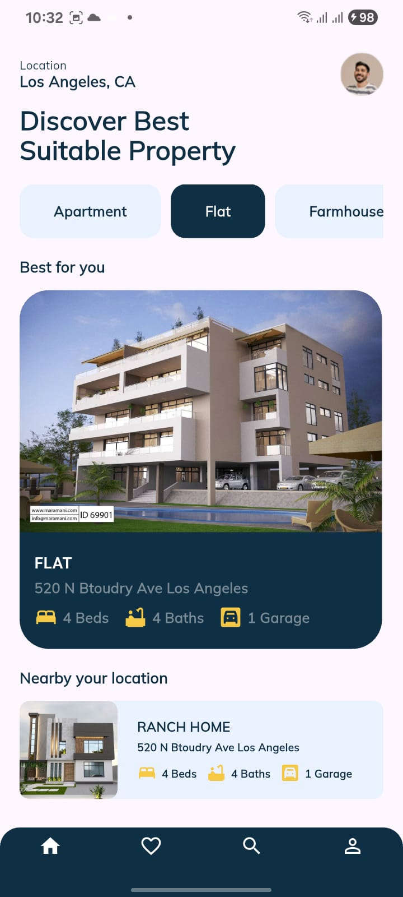
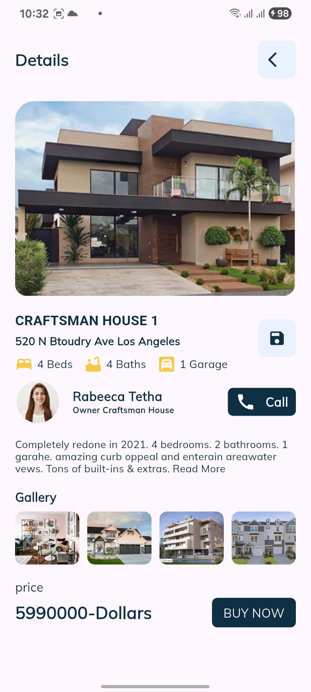
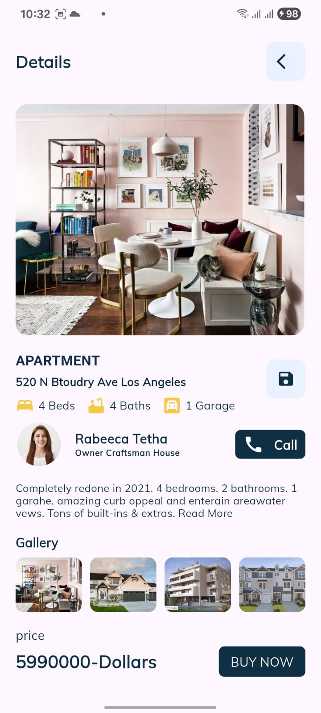
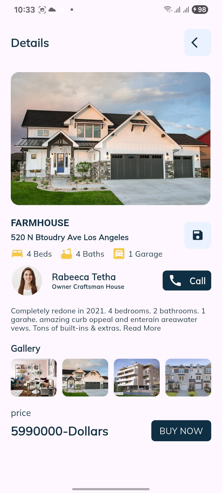

🏠 Trade App

A modern Flutter project with a clean and responsive UI for showcasing property listings (Houses, Apartments, Flats, etc).

📱 Screenshots
🏡 Home Screens

    

🏘️ Details Screens

    

🚀 Features

✅ Modern Flutter Property Listing UI
✅ Browse Houses, Apartments & Flats
✅ Property Details Page with Images
✅ Search & Filter Support (optional)
✅ Dark Mode Support (optional)

🛠️ Getting Started

This project is a starting point for a Flutter Trade/Property Listing application.

Lab: Write your first Flutter app

Cookbook: Useful Flutter samples

For more help, view the official Flutter documentation
.

🤝 Contributing

Contributions are welcome!
If you’d like to fix a bug or suggest a feature, feel free to open an issue or submit a pull request.

⭐ Show your support

If you like this project, give it a star ⭐ on GitHub — it helps others find it too!
